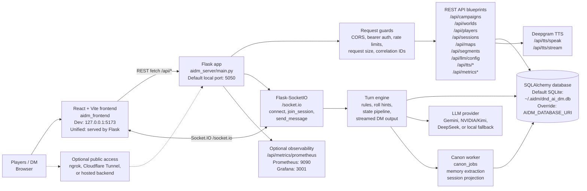
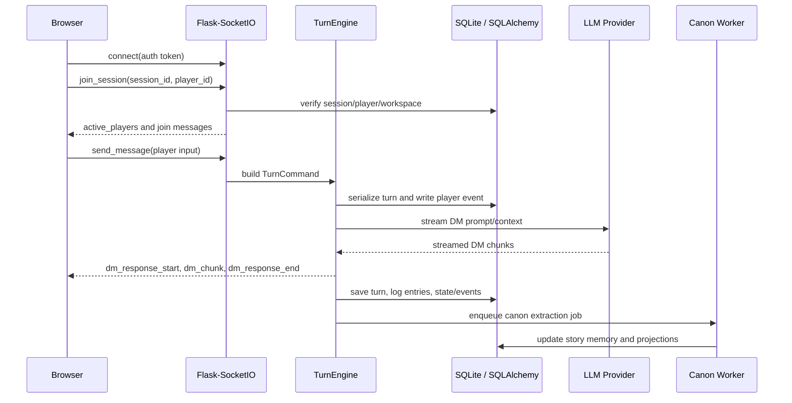
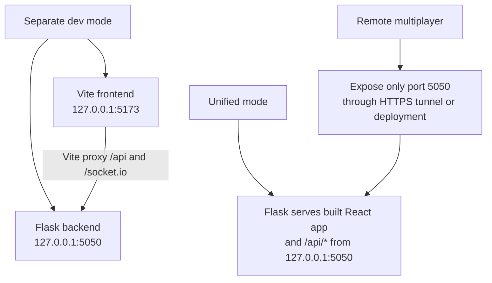

# AIDM Block Diagram

This is the high-level runtime map for the AIDM app: where the UI runs, where the APIs run, what database is used, and which outside services the backend can call.

## Main Runtime Blocks



## Where Each Part Runs

| Block | Runs Where | Main Files / Commands |
| --- | --- | --- |
| Frontend UI | Browser, usually from Vite during development or from Flask in unified mode | `aidm_frontend/src`, `npm run dev`, `make frontend` |
| Backend API | Local Python Flask process, default launcher port `5050` | `aidm_server/main.py`, `scripts/run_local_backend.sh`, `make backend` |
| Unified app | One Flask origin serving both built React assets and `/api/*` | `scripts/run_unified_local.sh`, `make unified` |
| Realtime gameplay | Same backend process through Flask-SocketIO | `aidm_server/blueprints/socketio_events.py`, `/socket.io` |
| Database | SQLite by default in the user home folder; can be changed with `AIDM_DATABASE_URI` | `aidm_server/database.py`, `aidm_server/models.py`, `migrations/` |
| AI model calls | External provider API or deterministic local fallback | `aidm_server/llm_providers.py`, `aidm_server/provider_registry.py` |
| TTS | External Deepgram API when configured | `aidm_server/blueprints/system.py`, `/api/tts/*` |
| Metrics | Backend memory snapshot, optional Prometheus/Grafana stack | `/api/metrics`, `/api/metrics/prometheus`, `observability/` |

## API Surface

| Area | REST Paths |
| --- | --- |
| System / health | `GET /api/health`, `GET /api/metrics`, `GET /api/metrics/prometheus` |
| Runtime AI config | `GET /api/llm/config`, `PATCH /api/llm/config`, `POST /api/llm/config` |
| Worlds | `POST /api/worlds`, `GET /api/worlds`, `GET/PATCH/DELETE /api/worlds/<world_id>` |
| Campaigns | `POST /api/campaigns`, `GET /api/campaigns`, `GET/PATCH/DELETE /api/campaigns/<campaign_id>`, archive/restore/workspace/canon endpoints |
| Players | `GET/POST /api/players/campaigns/<campaign_id>/players`, `GET/PATCH/DELETE /api/players/<player_id>` |
| Sessions | `POST /api/sessions/start`, `POST /api/sessions/<session_id>/end`, session list/import/archive/restore/delete/log/events/state endpoints |
| Maps | `POST /api/maps`, `GET /api/maps`, `GET/PUT/PATCH /api/maps/<map_id>` |
| Segments | `POST /api/segments`, `GET /api/segments`, `POST /api/segments/activate`, `GET/PUT/PATCH/DELETE /api/segments/<segment_id>` |
| TTS / feedback / beta | `GET /api/tts/config`, `POST /api/tts/speak`, `POST /api/tts/stream`, `POST /api/feedback/coherence`, `GET /api/beta/summary` |

## Socket.IO Gameplay Flow



## Database Map

The backend uses SQLAlchemy models and Alembic migrations. The default local database is:

```text
~/.aidm/dnd_ai_dm.db
```

The database can be redirected with:

```text
AIDM_DATABASE_URI
```

Main table groups:

| Group | Tables |
| --- | --- |
| Core campaign content | `worlds`, `campaigns`, `maps`, `players`, `sessions`, `npcs`, `campaign_segments`, `story_events` |
| Play history and session state | `player_actions`, `session_log_entries`, `dm_turns`, `turn_events`, `session_states` |
| Canon memory | `story_entities`, `story_facts`, `story_threads`, `turn_canon_updates`, `canon_jobs` |
| Operations and safety | `rate_limit_events`, `dm_coherence_feedback`, `session_turn_locks` |

## External Services And Env Vars

| Service | Purpose | Main Env Vars |
| --- | --- | --- |
| Gemini | DM narration/model generation | `AIDM_LLM_PROVIDER=gemini`, `GOOGLE_GENAI_API_KEY`, `AIDM_LLM_MODEL`, `AIDM_LLM_FALLBACK_MODELS` |
| NVIDIA / Kimi | OpenAI-compatible model generation | `AIDM_LLM_PROVIDER=nvidia` or `kimi`, `AIDM_NVIDIA_API_KEY`, `AIDM_NVIDIA_INVOKE_URL`, `AIDM_LLM_MODEL` |
| DeepSeek | OpenAI-compatible model generation | `AIDM_LLM_PROVIDER=deepseek`, `AIDM_DEEPSEEK_API_KEY`, `AIDM_DEEPSEEK_BASE_URL`, `AIDM_LLM_MODEL` |
| Local fallback | Deterministic no-key development mode | `AIDM_LLM_PROVIDER=fallback`, `AIDM_LLM_MODEL=deterministic-v1` |
| Deepgram | Text-to-speech audio | `AIDM_DEEPGRAM_API_KEY`, `AIDM_DEEPGRAM_TTS_MODEL` |
| External telemetry | Optional event delivery outside the process | `AIDM_TELEMETRY_ENABLED`, `AIDM_TELEMETRY_ENDPOINT`, `AIDM_TELEMETRY_API_KEY` |
| Auth and sharing | Protect public or tunneled play sessions | `AIDM_AUTH_REQUIRED`, `AIDM_API_AUTH_TOKENS`, `AIDM_API_AUTH_TOKEN_WORKSPACES` |

## Local Deployment Choices



For a cousin-level summary: the browser runs the React game UI, Flask runs the APIs and realtime socket server, SQLite stores the campaign/session/story state locally by default, and the backend calls external AI/TTS providers only when those API keys are configured.
